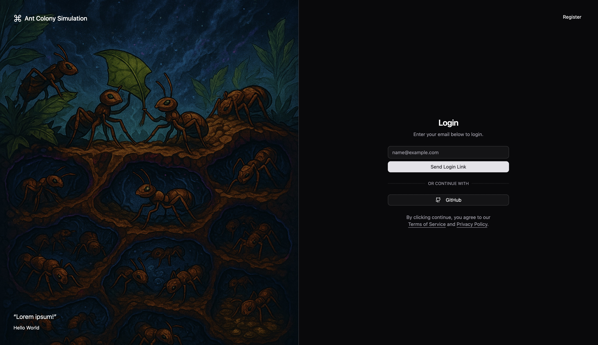

# Ant Colony Simulator



## Local development

```bash
# install dependencies
npm install

# create .env file
cp apps/pg-backend/.env.example apps/pg-backend/.env
cp apps/frontend/.env.example apps/frontend/.env
cp packages/db-drizzle/.env.example packages/db-drizzle/.env

# start all services
turbo dev
```

### Start single Services

```bash
# run local supabase server
npm run dev:db

# open supabase dashboard at http://127.0.0.1:54323/project/default

# run web app
npm run dev:frontend

# run rust backend
cd apps/rust-backend && sh ./run.sh

# open web app at http://127.0.0.1:3000
```

## Helpers

### Generate types

```bash
cd packages/db-drizzle
npx drizzle-kit generate
```

### Reset database

```bash
cd apps/supabase
npx supabase db reset
```

## Prep for first time setup

```bash
# install turbo cli
npm install turbo --global
```

## Simulation architecture

┌────────────────┐       ┌─────────────────────┐
│  Environment   │◀──────│  PheromoneField     │
│ - size, walls  │       │ - 2D grid of floats │
│ - food sources │       │ - diffuse(), decay()│
└────────────────┘       └─────────────────────┘
         ▲                         ▲
         │ senses grid             │ updated each tick
         │                         │
         │          ┌────────────────────────────┐
         └──────────┤        AntManager          ├──▶ logging, stats
                    │ - Vec<Ant>                 │
                    │ - tick()                   │
                    └────────────────────────────┘
                              │  
                              │ calls for each ant:
                              ▼
                       ┌─────────────────────┐
                       │   Ant (agent)       │
                       │ fields: position,   │
                       │ heading, state,     │
                       │ cargo, rng, etc.    │
                       └─────────────────────┘
