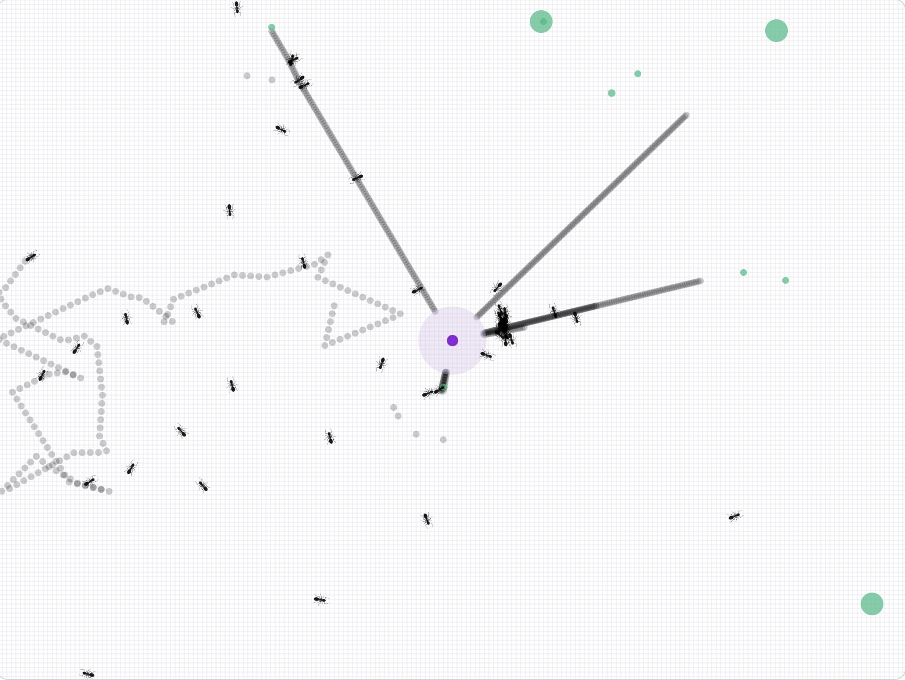
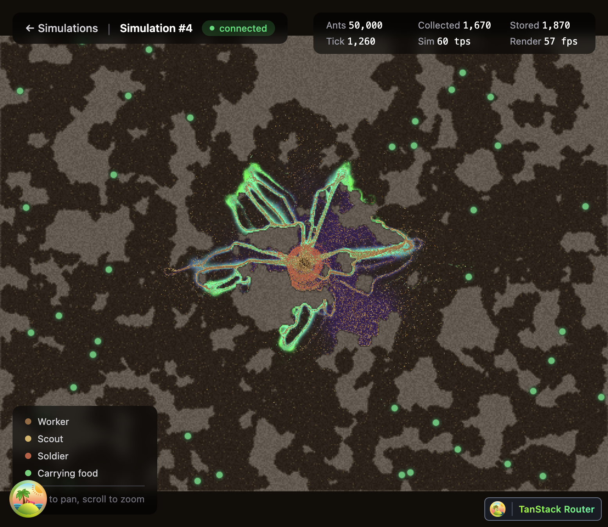

# Ant Colony Simulator

A real-time ant colony simulation: a Rust backend simulates up to 50,000+ ants at 60 ticks/s on procedurally generated terrain, streams state to the browser over a binary WebSocket protocol, and persists checkpoints to Postgres so simulations survive restarts.

| Before | After |
| ------ | ----- |
|  |  |

## Architecture

```
┌──────────────┐  binary WebSocket    ┌───────────────┐
│   Frontend   │◀────(ants 15 Hz,─────│  Rust backend │
│   :3000      │   pheromones 2 Hz)   │  :8080        │
│ TanStack     │                      │ axum + rayon  │
│ Start + Pixi │                      │ 60 Hz sim     │
└──────┬───────┘                      └──────┬────────┘
       │ Drizzle server fns                  │ sqlx
       │ (simulation CRUD)                   │ (checkpoints + stats)
       ▼                                     ▼
┌─────────────────────────────────────────────────────┐
│         Supabase Postgres :57322                    │
│  simulations · colonies · simulation_checkpoints    │
└─────────────────────────────────────────────────────┘
```

- **apps/rust-backend** — the simulation. Structure-of-arrays ant storage, rayon-parallel updates, pheromone grids, seeded fBm cave terrain with collision, binary WebSocket protocol, periodic bincode checkpoints to Postgres.
- **apps/frontend** — TanStack Start app with a PixiJS (WebGL) renderer: one `ParticleContainer` for all ants, terrain baked to a texture, additive pheromone heatmap, pan/zoom camera.
- **apps/supabase** — local Postgres + migrations.
- **packages/db-drizzle** — Drizzle schema/client shared by the frontend.

## Local development

```bash
# prerequisites: node (see .nvmrc), rust (rustup.rs), docker (for supabase)
npm install

# start everything (supabase, rust backend, frontend)
npm run dev
```

Then open http://localhost:3000, create a simulation, and watch it live.

### Individual services

```bash
npm run dev:db        # local supabase (studio at http://127.0.0.1:57323)
npm run dev:frontend  # web app at http://localhost:3000
npm run dev:backend   # rust simulation server at ws://127.0.0.1:8080/ws
```

### Reset database

```bash
cd apps/supabase && npx supabase db reset
```

## How it works

- The Rust backend runs one active simulation at 60 Hz. When a client subscribes with a `simulation_id`, the server loads that simulation's config from the `simulations` table and resumes from its latest checkpoint (or generates a fresh world from the config's seed).
- Terrain is seeded value-noise (fBm), thresholded and smoothed into caves, flood-filled so every open cell is reachable from the colony. Ants probe the grid ahead of them, steer along walls, and slide on collision.
- Ants forage with a three-sensor pheromone model (food/home grids), levy-flight exploration, and path integration to return home. Colonies spend stored food to spawn new ants.
- Wire protocol: binary frames — INIT (world + bitpacked terrain), ANTS (6 bytes/ant at 15 Hz, interpolated client-side), PHEROMONE (u8 grids at 2 Hz), FOOD — plus a 1 Hz JSON stats message for the HUD.
- Every 30 s (and on shutdown / simulation switch) the full sim state is bincode-serialized into `simulation_checkpoints.state_blob`; the latest 3 checkpoints per simulation are kept.
